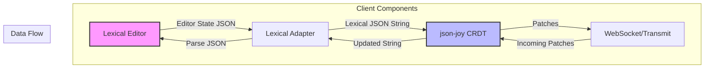

# Lexical Editor Integration Requirements Document

## Overview

This document outlines the requirements and proposed architecture for integrating Facebook's Lexical editor into the Reverb patient list application to provide rich text editing capabilities for text-heavy fields while maintaining real-time collaborative editing through the existing json-joy CRDT infrastructure.

## Business Requirements

### 1. Rich Text Editing

- Replace plain text inputs for `one_liner` and `hpi` fields with Lexical editor instances
- Support basic rich text formatting (bold, italic, underline, lists) without showing UI controls
- Preserve formatting across sessions and users
- Maintain clean, readable text display

### 2. Real-Time Collaboration

- Maintain existing real-time sync capabilities using json-joy CRDTs
- Ensure rich text formatting syncs properly between users
- No regression in sync performance or reliability

### 3. History Management

- Implement per-user undo/redo (Ctrl+Z/Ctrl+Y) functionality
- Each user should only undo their own changes
- Maintain operation history during the session
- Clear history on page reload (session-based)

## Technical Architecture

### Integration Approach



### Data Model Approach

**No CRDT schema changes required.** The existing string fields will store Lexical JSON:

```typescript
// Existing schema remains unchanged
const patientSchema = s.obj({
  one_liner: s.str(""), // Stores Lexical JSON
  hpi: s.str(""), // Stores Lexical JSON
  // ... other fields
});
```

### Lexical Integration Strategy

1. **Always Use Lexical**: All text fields use Lexical editor and store JSON format
2. **Plain Text Extraction**: Lexical component provides plain text for search/display
3. **Consistent Experience**: All users see rich text editing capabilities
4. **Simple Implementation**: No format detection or migration logic needed

## Implementation Details

### 1. Lexical Editor Component

Create a reusable `RichTextEditor` component:

```typescript
interface RichTextEditorProps {
  value: string; // Lexical JSON string
  onChange: (value: string) => void; // Returns Lexical JSON
  placeholder?: string;
  readOnly?: boolean;
  onUndo?: () => void; // Custom undo handler
  onRedo?: () => void; // Custom redo handler
  getPlainText: () => string; // Extract plain text for search/display
}
```

### 2. CRDT Synchronization

The synchronization flow:

1. **Local Edit**:

   - User types in Lexical editor
   - Editor state serialized to JSON
   - JSON string stored in CRDT `str` node
   - CRDT generates patch and queues for sync

2. **Remote Update**:
   - Patch received via WebSocket
   - CRDT applies patch to string node
   - Updated Lexical JSON passed to RichTextEditor
   - Lexical deserializes and updates editor state

### 3. History Implementation

#### Per-User Undo/Redo Architecture

json-joy provides built-in undo capabilities through its `Log` class and peritext UI components. We have two options:

**Option 1: Use json-joy's Built-in Undo System** (Recommended)
- The `Log` class has an `undo(patch: Patch)` method that generates inverse patches
- The peritext UI includes `MemoryUndo` and `WebUndo` implementations
- The `AnnalsController` shows how to integrate undo/redo with CRDTs

**Option 2: Custom Implementation**
- Build our own using json-joy's patch tracking
- More control but more complexity

#### Recommended Implementation Using json-joy's Log:

**Source Locations in json-joy:**
- `Log.undo()` method: `/src/json-crdt/log/Log.ts` (line ~182)
- `MemoryUndo` class: `/src/json-crdt-peritext-ui/web/dom/annals/MemoryUndo.ts`
- `AnnalsController` example: `/src/json-crdt-peritext-ui/web/dom/annals/AnnalsController.ts`

```typescript
import { Log } from 'json-joy/lib/json-crdt/log/Log';
import { MemoryUndo } from 'json-joy/lib/json-crdt-peritext-ui/web/dom/annals/MemoryUndo';
import type { UndoItem, UndoCallback } from 'json-joy/lib/json-crdt-peritext-ui/types';

// Create a log to track patches and generate undo operations
const log = Log.fromNewModel(model);

// Use MemoryUndo for managing undo/redo stacks
const undoManager = new MemoryUndo();

// Track captured patches for undo (following AnnalsController pattern)
const captured = new WeakSet<Patch>();

// Listen to flush events and capture patches for undo
model.api.onFlush.listen((patch) => {
  if (captured.has(patch)) {
    captured.delete(patch);
    
    // Create undo callback that uses Log's undo method
    const undoCallback: UndoCallback<Patch, Patch> = (doPatch) => {
      // Log.undo() automatically generates inverse patches!
      const undoPatch = log.undo(doPatch);
      model.applyPatch(undoPatch);
      return [doPatch, redoCallback];
    };
    
    // Push to undo stack
    const undoItem: UndoItem<Patch, Patch> = [patch, undoCallback];
    undoManager.push(undoItem);
  }
});
```

**How Log.undo() Works:**
The `Log.undo()` method (from `/src/json-crdt/log/Log.ts`) automatically generates inverse patches by:
1. Reversing string/array/binary insertions → deletions
2. For value changes, it replays the model to the state before the patch and captures the original value
3. For object/vector operations, it reconstructs the previous state
4. Returns a new Patch that undoes all operations in the original patch

#### Implementation Strategy:

1. **Leverage json-joy's Log Class**:
   - Use `Log.fromNewModel()` to create a patch log
   - Call `log.undo(patch)` to generate inverse patches automatically
   - No need to manually calculate inverses for each operation type

2. **Use Built-in Undo Manager**:
   - `MemoryUndo` provides undo/redo stack management
   - Follows the Command pattern with callbacks
   - Handles the complexity of managing undo/redo state

3. **Per-User Filtering**:
   - Track which user created each patch
   - Only add current user's patches to their undo stack
   - Preserve multi-user collaboration

4. **Integration Points**:
   ```typescript
   // In applyLocalChange
   const applyLocalChange = (callback) => {
     const patch = model.api.builder.patch;
     captured.add(patch); // Mark for undo tracking
     callback(model.api);
     // Patch will be captured in onFlush listener
   };
   ```

**Important Caveats:**
- These components are in the `json-crdt-peritext-ui` module which is focused on rich text editing
- The `MemoryUndo` and `AnnalsController` are specifically designed for the Peritext editor
- We may need to adapt these patterns for our use case with Lexical
- The Log class is in the core `json-crdt` module and is more generally applicable

### Undo/Redo Granularity Design

#### Context: Medical Application Requirements
In a medical context, undo/redo granularity is critical because:
1. Medical data entry must be precise and auditable
2. Users need to understand exactly what they're undoing
3. Accidental undos could remove critical patient information

#### Granularity Options Analysis

**Option 1: Character-by-Character (Too Fine)**
- ❌ Typing "Aspirin 81mg" would require 12 undos
- ❌ Extremely frustrating user experience
- ❌ Not practical for medical documentation

**Option 2: Word-by-Word**
- ✅ More natural for text editing
- ❌ Still too granular for structured medical data
- ❌ Inconsistent with form field editing

**Option 3: Field-Level Changes (Recommended)**
- ✅ Each field edit is one undo operation
- ✅ Clear and predictable for users
- ✅ Matches mental model of form editing
- ✅ Safe for medical context

**Option 4: Patient-Level Changes**
- ❌ Too coarse - undoing all changes to a patient
- ❌ Dangerous in medical context
- ❌ Poor user experience

#### Recommended Implementation: Field-Level with Smart Grouping

```typescript
interface UndoGranularity {
  // Group changes within a field during continuous typing
  groupingInterval: 2000, // 2 seconds of inactivity
  
  // Each field is a separate undo boundary
  fieldBoundaries: true,
  
  // Special handling for rich text fields
  richTextFields: {
    'one_liner': { groupByParagraph: false, groupByTime: true },
    'hpi': { groupByParagraph: true, groupByTime: true }
  }
}
```

#### Specific Granularity Rules

1. **Text Input Fields** (name, location, MRN):
   - One undo operation per field focus/blur cycle
   - Example: Changing "John" to "Jonathan" = 1 undo

2. **Rich Text Fields** (one_liner, hpi):
   - Group rapid typing (within 2 seconds)
   - New undo boundary on:
     - Paragraph break (Enter key)
     - 2+ seconds of inactivity
     - Field blur
   - Example: Typing a sentence = 1 undo, unless paused

3. **Structured Data** (todos, meds, labs):
   - Each item add/remove/edit = 1 undo
   - Checkbox toggles = 1 undo each
   - Example: Adding a medication = 1 undo

4. **Multi-Field Operations**:
   - Batch related changes when possible
   - Example: Pasting patient data that fills multiple fields = 1 undo

#### Implementation Strategy

```typescript
// Track field-level changes
const captureFieldChange = (fieldPath: string[], beforeValue: any) => {
  const patch = model.api.builder.patch;
  
  // Mark this patch for undo with field context
  captured.add(patch);
  patchMetadata.set(patch, {
    fieldPath,
    beforeValue,
    timestamp: Date.now(),
    userId: currentUser.id
  });
};

// Group related patches
const groupingWindow = 2000; // 2 seconds
let lastPatchTime = 0;
let currentGroup: Patch[] = [];

model.api.onFlush.listen((patch) => {
  const now = Date.now();
  const metadata = patchMetadata.get(patch);
  
  // Start new group if:
  // 1. Different field
  // 2. Time gap > groupingWindow
  // 3. Different operation type
  if (shouldStartNewGroup(metadata, now)) {
    if (currentGroup.length > 0) {
      // Create undo item for the group
      createUndoItem(currentGroup);
    }
    currentGroup = [patch];
  } else {
    // Add to current group
    currentGroup.push(patch);
  }
  
  lastPatchTime = now;
});
```

#### User Experience Guidelines

1. **Clear Undo Descriptions**:
   - "Undo: Change patient name"
   - "Undo: Update medications"
   - "Undo: Edit HPI"

2. **Visual Feedback**:
   - Show what will be undone on hover
   - Highlight affected fields briefly after undo

3. **Safety Measures**:
   - Confirm undo for critical fields (medications, allergies)
   - Show undo history with descriptions
   - Limit undo to current session

#### Special Considerations for Medical Context

1. **Audit Trail**: Even with undo, maintain complete audit log
2. **Critical Fields**: Some fields might be non-undoable (e.g., allergy alerts)
3. **Time Limits**: Consider time limits on undo (e.g., can't undo after 5 minutes)
4. **Cross-User Safety**: Never undo another user's changes

#### Concrete Example: User Workflow

Consider a user updating a patient's information:

1. **Action**: Changes patient location from "Room 101" to "Room 203"
   - **Undo Stack**: [Change location to "Room 203"]

2. **Action**: Types in HPI field: "Patient reports chest pain since yesterday."
   - **Undo Stack**: [Change location, Update HPI]

3. **Action**: Continues typing in HPI: " Pain is 7/10, radiating to left arm."
   - **Undo Stack**: [Change location, Update HPI] (grouped with previous)

4. **Action**: Waits 3 seconds, then adds: "\n\nNo shortness of breath."
   - **Undo Stack**: [Change location, Update HPI, Add to HPI] (new group)

5. **Action**: Adds medication: "Aspirin 81mg daily"
   - **Undo Stack**: [Change location, Update HPI, Add to HPI, Add medication]

6. **Action**: User presses Ctrl+Z
   - **Result**: Removes "Aspirin 81mg daily"
   - **Undo Stack**: [Change location, Update HPI, Add to HPI]
   - **Redo Stack**: [Add medication]

This granularity provides:
- Clear, understandable undo operations
- Efficient workflow (not too many undos needed)
- Safe medical documentation (can't accidentally undo too much)

### 4. Implementation Strategy

1. **Immediate Cutover**: Replace all text inputs with Lexical editors
2. **Initialize Empty**: New fields start with empty Lexical state
3. **No Migration**: Existing data will be replaced when fields are edited

## Proposed Code Changes

### 1. No CRDT Schema Changes Required

**Files remain unchanged**: `reverb-api/app/schemas/patient_list_crdt.ts` and `reverb-client/src/schemas/patientListCrdt.ts`

The existing string fields will store Lexical JSON:

```typescript
// No changes needed - existing fields will store Lexical JSON
const patientSchema = s.obj({
  // ... existing fields
  one_liner: s.str(""), // Stores Lexical JSON
  hpi: s.str(""), // Stores Lexical JSON
  // ... rest of fields
});
```

### 2. Create Lexical Editor Component

**New File**: `reverb-client/src/components/RichTextEditor/RichTextEditor.tsx`

Key features:

- Initialize Lexical with minimal plugins (bold, italic, underline, lists)
- Always expect and produce Lexical JSON format
- Handle serialization/deserialization
- Implement custom undo/redo commands
- Provide plain text extraction method

### 3. Create History Manager

**New File**: `reverb-client/src/hooks/useUndoHistory.ts`

Responsibilities:

- Initialize json-joy's Log and MemoryUndo
- Track operations by user
- Integrate with existing CRDT model
- Provide undo/redo interface

#### Implementation Using json-joy's Built-in Capabilities:

```typescript
import { Log } from 'json-joy/lib/json-crdt/log/Log';
import { MemoryUndo } from 'json-joy/lib/json-crdt-peritext-ui/web/dom/annals/MemoryUndo';
import type { Model } from 'json-joy/lib/json-crdt/model';
import type { Patch } from 'json-joy/lib/json-crdt-patch';

export function useUndoHistory(model: Model | null, userId: string) {
  const logRef = useRef<Log | null>(null);
  const undoManagerRef = useRef<MemoryUndo | null>(null);
  const capturedRef = useRef(new WeakSet<Patch>());
  
  useEffect(() => {
    if (!model) return;
    
    // Initialize Log for patch tracking
    logRef.current = Log.fromNewModel(model);
    undoManagerRef.current = new MemoryUndo();
    
    // Listen to patches and track for undo
    const unsubscribe = model.api.onFlush.listen((patch) => {
      if (capturedRef.current.has(patch)) {
        capturedRef.current.delete(patch);
        
        const undoCallback = (doPatch: Patch) => {
          // Use Log's built-in undo to generate inverse patch
          const undoPatch = logRef.current!.undo(doPatch);
          model.applyPatch(undoPatch);
          
          // Return redo item
          return [doPatch, redoCallback];
        };
        
        undoManagerRef.current!.push([patch, undoCallback]);
      }
    });
    
    return () => unsubscribe();
  }, [model, userId]);
  
  const capture = useCallback(() => {
    if (model) {
      capturedRef.current.add(model.api.builder.patch);
    }
  }, [model]);
  
  const undo = useCallback(() => {
    undoManagerRef.current?.undo();
  }, []);
  
  const redo = useCallback(() => {
    undoManagerRef.current?.redo();
  }, []);
  
  return { capture, undo, redo };
}
```

The key advantage is that json-joy's `Log.undo()` method automatically generates the correct inverse patches for all operation types, handling the complexity of CRDT operations.

### 4. Update Patient List Components

**Files to Update**:

- `reverb-client/src/components/PatientListPrintout/PatientEditor.tsx`
- Any other components that edit `one_liner` or `hpi` fields

Replace `<textarea>` or `<input>` with `<RichTextEditor>` component.

### 5. Add Lexical Dependencies

**File**: `reverb-client/package.json`

```json
{
  "dependencies": {
    "lexical": "^0.12.0",
    "@lexical/react": "^0.12.0",
    "@lexical/plain-text": "^0.12.0",
    "@lexical/rich-text": "^0.12.0",
    "@lexical/history": "^0.12.0",
    "@lexical/list": "^0.12.0"
  }
}
```

## Performance Considerations

1. **Serialization Overhead**: Lexical JSON states are larger than plain text

   - Mitigation: Only use Lexical for fields that benefit from rich text

2. **History Memory Usage**: Storing operation history per user

   - Mitigation: Limit history to last N operations
   - Clear history on session end

3. **Sync Frequency**: Rich text changes generate more patches
   - Mitigation: Batch patches more aggressively
   - Increase debounce time for Lexical changes

## Security Considerations

1. **XSS Prevention**: Lexical handles sanitization, but verify on server
2. **Content Size Limits**: Rich text can be larger; enforce limits
3. **History Privacy**: Ensure users can only undo their own operations

## Implmementation Plan

- Add Lexical dependencies
- Create RichTextEditor component
- Initialize all text fields with empty Lexical state

- Integrate RichTextEditor into patient fields
- Implement basic synchronization
- Test single-user scenarios

- Implement history manager
- Add per-user undo/redo
- Test multi-user scenarios

- Performance optimization
- Edge case handling
- Documentation

## Success Criteria

1. Rich text editing works seamlessly for one_liner and hpi fields
2. Real-time sync maintains sub-second latency
3. Undo/redo works correctly in multi-user scenarios
4. No regression in existing functionality
5. Performance remains acceptable with 10+ concurrent users

## Key Design Decisions

1. **No Schema Coupling**: CRDT remains editor-agnostic by storing strings
2. **Lexical-First**: All text fields use Lexical editor exclusively
3. **JSON Storage**: Fields always store Lexical JSON format
4. **Simple Implementation**: No backward compatibility or migration complexity

## Open Questions

1. Should we support paste-with-formatting from external sources? (only plain text)
2. What rich text features should be supported? (tables, images, etc.) (only text - heading, lists, bold, italic)
3. Should history persist across sessions? (No, session-based)
4. How many undo operations should we maintain? (infinite for this session)
5. Should we implement presence awareness (showing who is editing)? (YES eventually)

## Conclusion

This integration provides a modern rich text editing experience while maintaining the real-time collaborative features users expect. By keeping the CRDT schema unchanged and consistently using Lexical JSON format, we achieve a clean and simple implementation without backward compatibility concerns. The phased approach allows for iterative refinement based on user feedback.

## References

https://lexical.dev/docs/getting-started/react
https://lexical.dev/docs/react/plugins#lexicalhistoryplugin
https://lexical.dev/docs/api/modules/lexical_history
https://lexical.dev/docs/concepts/history
https://github.com/facebook/lexical/discussions/2481
