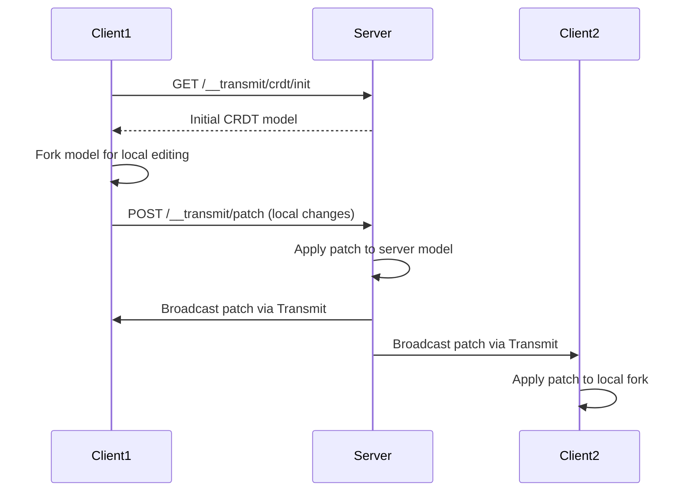

# Real-Time Sync Architecture for Reverb

This document outlines the JSON CRDT-based real-time synchronization architecture currently implemented in reverb-api and provides a guide for implementing similar functionality in reverb-client.

## Overview

The current implementation uses JSON CRDTs (Conflict-free Replicated Data Types) via the `json-joy` library combined with AdonisJS Transmit for WebSocket communication. This enables real-time collaborative editing with automatic conflict resolution.

## Architecture Components

### 1. Core Technologies

- **json-joy**: JSON CRDT implementation with patch-based synchronization
- **AdonisJS Transmit**: WebSocket framework for real-time event streaming
- **React**: Frontend with hooks for efficient state synchronization

### 2. Backend Architecture (reverb-api)

#### CRDT Model & Routes (`start/routes.ts`)

```typescript
// Schema definition using json-joy's schema builder
const schema = s.obj({
  items: s.arr([
    s.obj({
      input1: s.str(''),
      input2: s.str(''),
    }),
    // ... more items
  ]),
})

// Server maintains single source-of-truth model
const serverModel = Model.create(schema, getServerTimestamp())

// Routes:
// GET /__transmit/crdt/init - Returns initial CRDT model state
// POST /__transmit/patch - Receives patches from clients
```

Key features:
- Server model is the authoritative state
- Patches are broadcast to all connected clients via Transmit
- Structural compact encoding for efficient data transfer

#### Transmit Configuration

- WebSocket endpoints: `/__transmit/events`, `/__transmit/subscribe`, `/__transmit/unsubscribe`
- Channel authorization in `app/start/transmit.ts` for patient lists
- Uses `TransmitAuthService` for authentication

### 3. Frontend Architecture (Example Client)

#### TransmitProvider (`resources/js/providers/TransmitProvider.tsx`)

React context that manages the Transmit client connection:
- Creates single Transmit instance
- Provides `useTransmit()` and `useTransmitStream()` hooks
- Handles subscription lifecycle

#### CRDT Client Component (`resources/js/components/App.tsx`)

```typescript
// Key implementation steps:
1. Fetch initial model state from server
2. Create a fork of the model for local editing
3. Subscribe to patch stream via Transmit
4. Apply incoming patches to maintain consistency
5. Debounced sync of local changes back to server
```

Uses `useSyncExternalStore` for efficient React rendering when CRDT data changes.

## Data Flow



## Implementation Guide for reverb-client

### Phase 1: Setup Infrastructure

1. **Install Dependencies**
   ```bash
   npm install json-joy @adonisjs/transmit-client lodash.debounce
   npm install -D @types/lodash.debounce
   ```

2. **Create Transmit Provider**
   - Copy the TransmitProvider pattern from the example
   - Integrate with existing authentication (JWT tokens)
   - Add to your app's root provider hierarchy

### Phase 2: Define CRDT Schema for Patient Lists

```typescript
// Example schema for patient list collaboration
const patientListSchema = s.obj({
  metadata: s.obj({
    name: s.str(''),
    lastModified: s.num(0),
    version: s.num(1),
  }),
  patients: s.arr([
    s.obj({
      id: s.str(''),
      name: s.str(''),
      mrn: s.str(''),
      room: s.str(''),
      diagnosis: s.str(''),
      notes: s.str(''),
      vitals: s.obj({
        bp: s.str(''),
        hr: s.num(0),
        temp: s.num(0),
      }),
      tasks: s.arr([
        s.obj({
          id: s.str(''),
          description: s.str(''),
          completed: s.bool(false),
        })
      ])
    })
  ])
})
```

### Phase 3: Create Real-Time Hooks

```typescript
// useRealtimePatientList.ts
export function useRealtimePatientList(listId: string) {
  const [model, setModel] = useState<Model | null>(null)
  const patches = useTransmitStream<PatchData>(`patient-list/${listId}`)
  
  // Initialize model
  useEffect(() => {
    fetchInitialModel(listId).then(setModel)
  }, [listId])
  
  // Apply incoming patches
  useEffect(() => {
    if (model && patches) {
      model.applyPatch(decodePatch(patches))
    }
  }, [model, patches])
  
  // Sync local changes
  useEffect(() => {
    if (!model) return
    
    const sync = debounce(() => {
      const patches = model.api.flush()
      sendPatches(listId, patches)
    }, 100)
    
    return model.api.onLocalChanges.listen(sync)
  }, [model, listId])
  
  return { model, isLoading: !model }
}
```

### Phase 4: Update Existing Components

1. **Replace Direct API Calls**
   - Current: `await api.updatePatient(id, data)`
   - New: Update via CRDT model operations

2. **Create CRDT-Aware Components**
   ```typescript
   // Example: Real-time patient name editor
   function PatientNameEditor({ model, patientIndex }) {
     const nameNode = useMemo(
       () => model.api.str(['patients', patientIndex, 'name']),
       [model, patientIndex]
     )
     
     const name = useSyncExternalStore(
       nameNode.events.subscribe,
       nameNode.events.getSnapshot
     )
     
     return (
       <Input
         value={name}
         onChange={(e) => {
           nameNode.del(0, nameNode.length())
           nameNode.ins(0, e.target.value)
         }}
       />
     )
   }
   ```

### Phase 5: Handle Authentication & Authorization

1. **Modify Transmit Connection**
   ```typescript
   const transmit = new Transmit({
     baseUrl: API_BASE_URL,
     beforeSubscribe: async (request) => {
       const token = getAuthToken()
       request.headers.set('Authorization', `Bearer ${token}`)
     }
   })
   ```

2. **Subscribe to Authorized Channels**
   - Use patient list URL safe names as channel identifiers
   - Server already has authorization logic in `transmit.ts`

### Phase 6: Optimize Performance

1. **Selective Syncing**
   - Only sync fields that changed
   - Use path-based updates for nested data

2. **Conflict Resolution**
   - json-joy handles most conflicts automatically
   - Add UI indicators for active collaborators
   - Show presence awareness (who's editing what)

3. **Offline Support**
   - Queue patches when offline
   - Sync when connection restored
   - Use optimistic updates

## Backend Modifications Needed

1. **Update Routes**
   - Move CRDT routes to versioned API structure
   - Add patient-list-specific CRDT endpoints

2. **Enhance Authorization**
   - Ensure CRDT operations respect existing RBAC
   - Add rate limiting for patch operations

3. **Persistence**
   - Store CRDT model state in PostgreSQL
   - Implement model recovery on server restart

## Migration Strategy

1. **Start with Read-Only Real-Time Updates**
   - Implement Transmit streaming for existing patient list changes
   - No CRDT initially, just broadcast updates

2. **Add Collaborative Editing for Notes**
   - Implement CRDT for patient notes field only
   - Test with limited users

3. **Expand to Full Patient Data**
   - Gradually add more fields to CRDT schema
   - Maintain backward compatibility

4. **Add Advanced Features**
   - Presence awareness
   - Cursor positions
   - Typing indicators

## Security Considerations

1. **Authentication**: All WebSocket connections must be authenticated
2. **Authorization**: Channel-level permissions based on user's patient list access
3. **Validation**: Server must validate all incoming patches
4. **Rate Limiting**: Prevent patch flooding attacks
5. **Data Encryption**: Use WSS for secure WebSocket connections

## Testing Strategy

1. **Unit Tests**
   - CRDT operations
   - Patch encoding/decoding
   - React hooks

2. **Integration Tests**
   - Multi-client synchronization
   - Conflict resolution
   - Network failure recovery

3. **E2E Tests**
   - Real-time collaboration scenarios
   - Permission boundaries
   - Performance under load

## Performance Metrics to Monitor

- Patch size and frequency
- Sync latency
- Memory usage (CRDT models can grow)
- WebSocket connection stability
- Concurrent user limits

## Resources

- [json-joy Documentation](https://github.com/streamich/json-joy)
- [AdonisJS Transmit](https://docs.adonisjs.com/guides/transmit)
- [CRDT Primer](https://crdt.tech/)