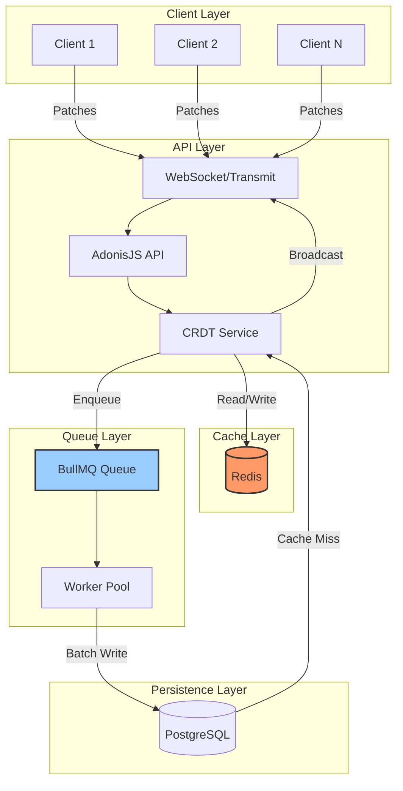
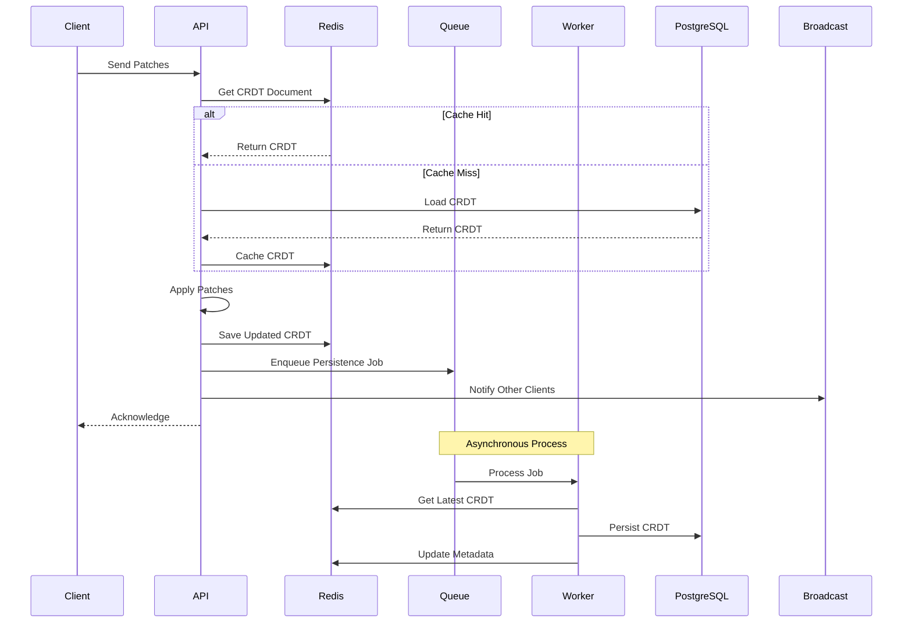
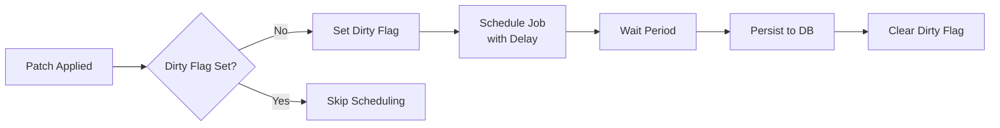
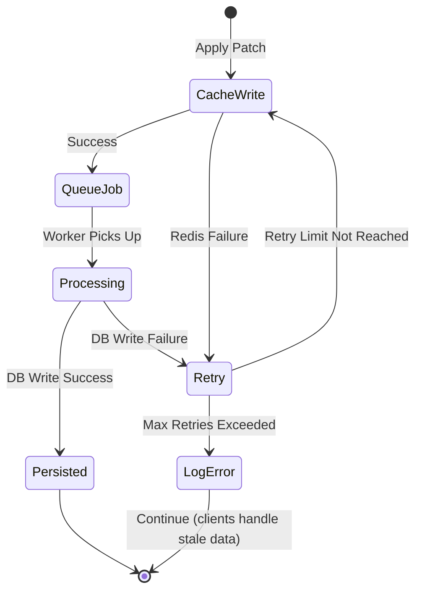

# Redis-Based CRDT Architecture with Asynchronous Database Writes

## Executive Summary

This document outlines a proposed architecture for improving CRDT performance by using Redis as a high-performance cache layer with asynchronous writes to PostgreSQL. This approach reduces database load, improves response times, and enhances scalability while maintaining data durability.

## Current Architecture Issues

1. **Every patch operation requires**:

   - Loading entire CRDT document from PostgreSQL
   - Applying patches in memory
   - Writing entire CRDT document back to PostgreSQL

2. **Performance Impact**:
   - Database I/O on every keystroke
   - Increased latency for real-time collaboration
   - Database becomes a bottleneck under load

## Proposed Architecture

### High-Level Overview



### Detailed Data Flow



## Component Design

### 1. Redis Cache Structure

```typescript
// Key Patterns using URL-safe names (matching WebSocket channels)
crdt:{tenantUrlSafeName}:{listUrlSafeName}:doc        // The CRDT document (binary)
crdt:{tenantUrlSafeName}:{listUrlSafeName}:version    // Current version number
crdt:{tenantUrlSafeName}:{listUrlSafeName}:lock       // Distributed lock for updates
crdt:{tenantUrlSafeName}:{listUrlSafeName}:dirty      // Flag indicating pending DB write
crdt:{tenantUrlSafeName}:{listUrlSafeName}:metadata   // Additional metadata (JSON)

// Example Keys (matching org/tenant/patient-lists/name pattern)
crdt:c-default-org-yd58xa7u2dk:default:doc       // CRDT binary data
crdt:c-default-org-yd58xa7u2dk:default:version   // "42"
crdt:c-default-org-yd58xa7u2dk:default:lock      // "worker_1:1234567890"
crdt:c-default-org-yd58xa7u2dk:default:dirty     // "1"
```

### 2. Cache Service Implementation (Using @adonisjs/cache)

The AdonisJS cache library provides a powerful abstraction layer that simplifies our implementation while adding advanced features like multi-tier caching, stampede protection, and grace periods.

```typescript
import cache from "@adonisjs/cache/services/main";
import redis from "@adonisjs/redis/services/main";

export default class CRDTCacheService {
  private readonly cacheTTL = "5m";
  private readonly graceTime = "30s";

  /**
   * Get CRDT with multi-tier caching (memory + Redis)
   */
  async get(tenantId: string, listId: string): Promise<Buffer | null> {
    // Use multi-tier cache: L1 (memory) -> L2 (Redis)
    return await cache.use("multi").get(`crdt:${tenantId}:${listId}:doc`);
  }

  /**
   * Get or regenerate CRDT with stampede protection
   */
  async getOrSet(
    tenantId: string,
    listId: string,
    factory: () => Promise<Buffer>
  ): Promise<Buffer> {
    return await cache
      .use("multi")
      .getOrSet(`crdt:${tenantId}:${listId}:doc`, factory, {
        ttl: this.cacheTTL,
        grace: this.graceTime, // Return stale data while regenerating
        tags: [`tenant:${tenantId}`, `list:${listId}`],
      });
  }

  /**
   * Set CRDT with tagging for easy invalidation
   */
  async set(tenantId: string, listId: string, doc: Buffer): Promise<void> {
    await cache.use("multi").set(`crdt:${tenantId}:${listId}:doc`, doc, {
      ttl: this.cacheTTL,
      tags: [`tenant:${tenantId}`, `list:${listId}`],
    });

    // Also mark as dirty for async persistence
    await redis.set(`crdt:${tenantId}:${listId}:dirty`, "1", "EX", 300);
  }

  /**
   * Invalidate all caches for a list
   */
  async invalidate(tenantId: string, listId: string): Promise<void> {
    // Clear by tags - removes from all cache tiers
    await cache.use("multi").clear([`list:${listId}`]);
  }

  /**
   * Atomic operations using Redis directly for fine control
   */
  async getAndLock(
    tenantId: string,
    listId: string,
    lockDuration: number
  ): Promise<Buffer | null> {
    const lockKey = `crdt:${tenantId}:${listId}:lock`;
    const lockId = `${process.pid}:${Date.now()}`;

    // Try to acquire lock
    const acquired = await redis.set(lockKey, lockId, "NX", "EX", lockDuration);
    if (!acquired) return null;

    // Get from cache
    const doc = await this.get(tenantId, listId);
    return doc;
  }
}
```

#### Cache Configuration

```typescript
// config/cache.ts
import { defineConfig, stores } from "@adonisjs/cache";

export default defineConfig({
  default: "multi",

  stores: {
    // In-memory L1 cache for hot data
    memory: stores.memory({
      maxSize: 100 * 1024 * 1024, // 100MB
    }),

    // Redis L2 cache
    redis: stores.redis({
      connection: "cache",
    }),

    // Multi-tier cache (memory -> Redis)
    multi: stores.multi({
      stores: ["memory", "redis"],
      strategy: "write-through", // Write to all tiers
    }),
  },

  // Global cache settings
  ttl: "10m",

  // Events for monitoring
  events: {
    "cache:hit": true,
    "cache:miss": true,
    "cache:write": true,
    "cache:forget": true,
  },
});
```

#### Benefits of Using @adonisjs/cache

1. **Multi-tier Caching**: Hot CRDTs stay in memory, warm in Redis
2. **Stampede Protection**: Prevents multiple requests from regenerating the same CRDT
3. **Grace Periods**: Serve stale data while regenerating in background
4. **Cache Tagging**: Easily invalidate all caches for a tenant or list
5. **Built-in Monitoring**: Cache hit/miss events for metrics

### 3. Queue Implementation with @rlanz/bull-queue

Using [@rlanz/bull-queue](https://github.com/RomainLanz/adonis-bull-queue) for reliable job processing:

```typescript
// app/jobs/persist_crdt.ts
import { Job } from "@rlanz/bull-queue";
import redis from "@adonisjs/redis/services/main";
import PatientList from "#models/patient_list";
import Tenant from "#models/tenant";

export interface PersistCRDTPayload {
  tenantUrlSafeName: string;
  listUrlSafeName: string;
  version: number;
}

export default class PersistCRDT extends Job {
  static get key() {
    return "PersistCRDT";
  }

  static get options() {
    return {
      attempts: 3,
      backoff: {
        type: "exponential",
        delay: 2000,
      },
      removeOnComplete: true,
      removeOnFail: false,
    };
  }

  async handle(payload: PersistCRDTPayload) {
    const { tenantUrlSafeName, listUrlSafeName, version } = payload;

    // Get latest from Redis
    const cacheKey = `crdt:${tenantUrlSafeName}:${listUrlSafeName}:doc`;
    const cachedDoc = await redis.get(cacheKey);
    const cachedVersion = await redis.get(`${cacheKey}:version`);

    // Version check to prevent overwriting newer data
    if (parseInt(cachedVersion) < version) {
      console.log(`[PersistCRDT] Skipping - newer version already persisted`)
      return;
    }

    // Look up tenant and list by URL-safe names
    const tenant = await Tenant.query()
      .where('url_safe_name', tenantUrlSafeName)
      .first();
      
    if (!tenant) {
      throw new Error(`Tenant not found: ${tenantUrlSafeName}`);
    }

    // Validate CRDT before persisting
    const crdtBuffer = Buffer.from(cachedDoc, "base64");
    let model: Model;
    
    try {
      model = Model.fromBinary(crdtBuffer);
      
      // Validate structure matches schema
      const view = model.view();
      if (!view || typeof view !== 'object') {
        throw new Error('Invalid CRDT structure');
      }
      
      // Validate no patch corruption in patient data
      if (view.patients && Array.isArray(view.patients)) {
        for (const patient of view.patients) {
          const invalidKeys = Object.keys(patient).filter((key) => /^\d+$/.test(key));
          if (invalidKeys.length > 0) {
            throw new Error(`CRDT validation failed: Patient ${patient.id} contains patch operation keys`);
          }
        }
      }
    } catch (error) {
      console.error('[PersistCRDT] Invalid CRDT document, skipping persistence:', error);
      // Mark as clean anyway to prevent retry loops
      await redis.del(`${cacheKey}:dirty`);
      throw new Error(`Invalid CRDT document: ${error.message}`);
    }

    // Persist to database using transaction
    await db.transaction(async (trx) => {
      const patientList = await PatientList.query()
        .where("tenant_id", tenant.id)
        .where("url_safe_name", listUrlSafeName)
        .forUpdate() // Lock the row
        .first();
        
      if (!patientList) {
        throw new Error(`Patient list not found: ${listUrlSafeName}`);
      }
      
      patientList.useTransaction(trx);
      patientList.crdtDocument = crdtBuffer;
      patientList.crdtVersion = parseInt(cachedVersion);
      await patientList.save();
    });

    // Mark as clean in Redis
    await redis.del(`${cacheKey}:dirty`);
    
    console.log(`[PersistCRDT] Successfully persisted ${listUrlSafeName} for tenant ${tenantUrlSafeName}`);
  }
}

// Usage in service layer
import Queue from "@rlanz/bull-queue/services/main";

// Enqueue persistence job
await Queue.dispatch('PersistCRDT', {
  tenantUrlSafeName: patientList.tenant.urlSafeName,
  listUrlSafeName: patientList.urlSafeName,
  version: result.version
});
```

### 4. Write Strategies

#### Strategy 1: Debounced Writes (Recommended)



**Benefits**:

- Reduces database writes
- Groups multiple updates
- Better for rapid typing

**Configuration**:

```typescript
const WRITE_DELAY = 5000; // 5 seconds
const MAX_WRITE_DELAY = 30000; // 30 seconds max
```

#### Strategy 2: Write-Through for Critical Operations

```typescript
// For critical operations (e.g., patient discharge)
async applyCriticalPatch(patch: Patch) {
  await this.applyPatch(patch)
  await this.persistImmediately() // Skip queue, write directly
}
```

### 5. Failure Handling



### 6. Cache Warming Strategy

- **On Startup**: Pre-load frequently accessed patient lists (last 24 hours)
- **Cache Miss Handling**: Load from database and populate cache with appropriate TTL
- **TTL Strategy**: Recently accessed data gets longer TTL (2 hours vs 1 hour)

## Integration with Existing Code

### Service Layer Extension

Instead of modifying the controller directly, extend the existing `PatientListService` to support caching:

```typescript
// app/services/patient_list_service.ts
import { inject } from '@adonisjs/core'
import CRDTCacheService from '#services/crdt_cache_service'
import app from '@adonisjs/core/services/app'
import Config from '@adonisjs/core/services/config'
import Queue from "@rlanz/bull-queue/services/main"

@inject()
export class PatientListService {
  // ... existing code ...

  /**
   * Get CRDT document with caching support
   */
  async getCRDTDocument(patientList: PatientList): Promise<Buffer | null> {
    // Check if Redis caching is enabled for this tenant
    const cacheEnabled = await this.shouldUseCache(patientList.tenantId)
    
    if (cacheEnabled) {
      const cacheService = await app.container.make(CRDTCacheService)
      const cached = await cacheService.get(
        patientList.tenant.urlSafeName,
        patientList.urlSafeName
      )
      
      if (cached) {
        console.log(`[CRDT] Cache hit for ${patientList.urlSafeName}`)
        return cached
      }
      
      // Cache miss - warm cache if document exists
      if (patientList.crdtDocument) {
        console.log(`[CRDT] Cache miss for ${patientList.urlSafeName}, warming cache`)
        await cacheService.set(
          patientList.tenant.urlSafeName,
          patientList.urlSafeName,
          patientList.crdtDocument
        )
      }
    }
    
    return patientList.crdtDocument
  }

  /**
   * Apply patches with caching and queued persistence
   */
  async applyPatchesToCRDT(
    patientList: PatientList,
    patches: any[],
    userId: number
  ): Promise<{ updatedCrdt: Buffer; version: number }> {
    const cacheEnabled = await this.shouldUseCache(patientList.tenantId)
    
    if (cacheEnabled) {
      const cacheService = await app.container.make(CRDTCacheService)
      
      // Apply patches through cache service
      const result = await cacheService.applyPatches(
        patientList.tenant.urlSafeName,
        patientList.urlSafeName,
        patches,
        userId
      )
      
      // Enqueue persistence job
      await Queue.dispatch('PersistCRDT', {
        tenantUrlSafeName: patientList.tenant.urlSafeName,
        listUrlSafeName: patientList.urlSafeName,
        version: result.version
      })
      
      return result
    }
    
    // Fallback to direct database operations (existing logic)
    const model = Model.fromBinary(new Uint8Array(patientList.crdtDocument))
    
    for (const patchData of patches) {
      const patch = decodeVerbose(patchData)
      model.applyPatch(patch)
    }
    
    const updatedBinary = model.toBinary()
    const updatedVersion = (model.clock.tick(0) as any).time || 0
    
    await db.transaction(async (trx) => {
      patientList.useTransaction(trx)
      patientList.crdtDocument = Buffer.from(updatedBinary)
      patientList.crdtVersion = updatedVersion
      await patientList.save()
    })
    
    return {
      updatedCrdt: Buffer.from(updatedBinary),
      version: updatedVersion
    }
  }

  private async shouldUseCache(tenantId: number): Promise<boolean> {
    const featureService = await app.container.make('FeatureFlagService')
    return featureService.shouldUseRedisCache(tenantId.toString())
  }
}
```

### Minimal Controller Changes

The controller requires minimal changes, preserving existing validation and patterns:

```typescript
// app/controllers/patient_list_crdts_controller.ts
export default class PatientListCrdtsController {
  /**
   * Get CRDT state for a patient list
   */
  async getCRDTState({ params, request, response, auth, bouncer }: HttpContext) {
    // ... existing auth and lookup logic remains unchanged ...
    
    // Use service to get CRDT document (with caching if enabled)
    const patientListService = await app.container.make(PatientListService)
    const crdtDocument = await patientListService.getCRDTDocument(patientList)
    
    if (!crdtDocument) {
      return response.ok({ crdt: [] })
    }
    
    // Convert Buffer to array of numbers for JSON serialization
    const crdtArray = Array.from(crdtDocument)
    
    return response.ok({
      crdt: crdtArray,
      version: patientList.crdtVersion,
    })
  }

  /**
   * Apply patches to CRDT and broadcast changes
   */
  async applyPatches({ request, params, response, auth, bouncer }: HttpContext) {
    // ... existing auth, validation, and CRDT validation logic (lines 156-233) ...
    
    const patientListService = await app.container.make(PatientListService)
    
    try {
      // Apply patches through service (handles caching internally)
      const { version } = await patientListService.applyPatchesToCRDT(
        patientList,
        patches,
        user.id
      )
      
      // Broadcast patches to all connected clients (unchanged)
      const channelName = `org/${patientList.tenant.urlSafeName}/patient-lists/${urlSafeName}`
      transmit.broadcast(channelName, {
        patches,
        version,
        userId: user.id,
      })
      
      return response.ok({
        success: true,
        version,
      })
    } catch (error) {
      console.error('Failed to apply patches:', error)
      return response.internalServerError({ error: 'Failed to apply patches' })
    }
  }
}
```

## Error Handling Strategy

### Specific Error Scenarios and Responses

```typescript
// app/services/crdt_cache_service.ts
export default class CRDTCacheService {
  private readonly FALLBACK_TO_DB = true // Configurable
  
  async get(tenantUrlSafeName: string, listUrlSafeName: string): Promise<Buffer | null> {
    try {
      const cached = await redis.get(this.getKey(tenantUrlSafeName, listUrlSafeName))
      if (cached) return Buffer.from(cached, 'base64')
      return null
    } catch (error) {
      console.error('[CRDTCache] Redis connection failed:', error)
      
      if (this.FALLBACK_TO_DB) {
        // Fallback to direct database access
        console.warn('[CRDTCache] Falling back to database')
        
        // Look up tenant by URL-safe name
        const tenant = await Tenant.query()
          .where('url_safe_name', tenantUrlSafeName)
          .first()
        
        if (!tenant) return null
        
        const patientList = await PatientList.query()
          .where('tenant_id', tenant.id)
          .where('url_safe_name', listUrlSafeName)
          .first()
          
        return patientList?.crdtDocument || null
      }
      
      // If no fallback, throw error for 503 response
      throw new Error('Cache service unavailable')
    }
  }

  async applyPatches(
    tenantUrlSafeName: string, 
    listUrlSafeName: string, 
    patches: any[],
    userId: number
  ): Promise<{ updatedCrdt: Buffer; version: number }> {
    const maxRetries = 3
    let lastError: Error | null = null
    
    for (let attempt = 1; attempt <= maxRetries; attempt++) {
      try {
        // Get current CRDT
        let crdt = await this.get(tenantUrlSafeName, listUrlSafeName)
        
        if (!crdt) {
          // Initialize new CRDT if not found (for default lists)
          const model = Model.create(patientListSchema)
          const initialData = createEmptyPatientListCRDT()
          model.api.root(initialData)
          crdt = Buffer.from(model.toBinary())
        }
        
        // Validate CRDT integrity
        let model: Model
        try {
          model = Model.fromBinary(crdt)
        } catch (parseError) {
          console.error('[CRDTCache] Corrupt CRDT detected, reloading from DB')
          // Delete corrupt cache entry
          await redis.del(this.getKey(tenantUrlSafeName, listUrlSafeName))
          
          // Reload from database
          const tenant = await Tenant.query()
            .where('url_safe_name', tenantUrlSafeName)
            .first()
          
          if (!tenant) throw new Error('Tenant not found')
          
          const patientList = await PatientList.query()
            .where('tenant_id', tenant.id)
            .where('url_safe_name', listUrlSafeName)
            .first()
            
          if (!patientList?.crdtDocument) {
            throw new Error('No valid CRDT document found')
          }
          
          crdt = patientList.crdtDocument
          model = Model.fromBinary(crdt)
        }
        
        // Apply patches with validation
        for (const patchData of patches) {
          // Validate patch size
          const patchSize = JSON.stringify(patchData).length
          if (patchSize > 1024 * 100) { // 100KB patch limit
            throw new Error(`Patch too large: ${patchSize} bytes`)
          }
          
          // Apply patch
          const patch = decodeVerbose(patchData)
          model.applyPatch(patch)
        }
        
        // CRITICAL: Validate CRDT structure after patches (from existing controller)
        const view = model.view()
        if (view.patients && Array.isArray(view.patients)) {
          for (const patient of view.patients) {
            // Check for patch operation data that shouldn't be in patient objects
            const invalidKeys = Object.keys(patient).filter((key) => {
              // Numeric string keys like "0", "1" etc are signs of patch corruption
              return /^\d+$/.test(key)
            })
            
            if (invalidKeys.length > 0) {
              console.error('CRDT validation failed: Patient object contains patch operation keys:', {
                patientId: patient.id,
                invalidKeys,
                patient,
              })
              throw new Error('CRDT validation failed: Patient data corrupted with patch operations')
            }
          }
        }
        
        // Check final CRDT size
        const updatedCrdt = Buffer.from(model.toBinary())
        const updatedVersion = (model.clock.tick(0) as any).time || 0
        
        if (updatedCrdt.length > 1024 * 1024 * 10) { // 10MB limit
          throw new Error('CRDT document exceeds size limit')
        }
        
        // Save to cache
        await this.set(tenantUrlSafeName, listUrlSafeName, updatedCrdt, updatedVersion)
        
        return { updatedCrdt, version: updatedVersion }
      } catch (error) {
        lastError = error as Error
        console.error(`[CRDTCache] Attempt ${attempt} failed:`, error)
        
        if (attempt < maxRetries) {
          // Exponential backoff
          await new Promise(resolve => setTimeout(resolve, Math.pow(2, attempt) * 100))
        }
      }
    }
    
    throw lastError || new Error('Failed to apply patches after retries')
  }
}

// Queue error handling
export default class PersistCRDT extends Job {
  static get options() {
    return {
      attempts: 3,
      backoff: {
        type: 'exponential',
        delay: 2000,
      },
      removeOnComplete: true,
      removeOnFail: false, // Keep failed jobs for inspection
    }
  }

  async handle(payload: PersistCRDTPayload) {
    const { tenantId, listId, version } = payload
    
    try {
      // Check queue depth for backpressure
      const queueStats = await Queue.queue.getJobCounts()
      if (queueStats.waiting > 10000) {
        console.error('[PersistCRDT] Queue depth critical:', queueStats.waiting)
        // Could implement circuit breaker here
      }
      
      // Perform persistence...
    } catch (error) {
      console.error('[PersistCRDT] Persistence failed:', error)
      
      // On final retry failure, alert
      if (this.job.attemptsMade >= 3) {
        console.error('[PersistCRDT] CRITICAL: Failed to persist after all retries', {
          tenantId,
          listId,
          error: error.message
        })
        
        // Could send alert to monitoring system
        // await AlertService.send('crdt.persistence.failed', { tenantId, listId })
      }
      
      throw error // Re-throw for retry
    }
  }
}
```

## Security Considerations

### Patch Validation and Cache Integrity

```typescript
// app/services/crdt_cache_service.ts
import crypto from 'crypto'

export default class CRDTCacheService {
  // Rate limiting per user
  private rateLimiter = new Map<string, { count: number; resetAt: number }>()
  
  async validateAndApplyPatches(
    userId: string,
    tenantId: string,
    listId: string,
    patches: any[]
  ): Promise<Buffer> {
    // 1. Rate limiting
    const userKey = `${userId}:${tenantId}`
    const now = Date.now()
    const userLimits = this.rateLimiter.get(userKey) || { count: 0, resetAt: now + 60000 }
    
    if (now > userLimits.resetAt) {
      userLimits.count = 0
      userLimits.resetAt = now + 60000
    }
    
    userLimits.count += patches.length
    if (userLimits.count > 100) { // 100 patches per minute
      throw new Error('Rate limit exceeded')
    }
    
    this.rateLimiter.set(userKey, userLimits)
    
    // 2. Validate patch structure
    for (const patch of patches) {
      if (!this.isValidPatch(patch)) {
        throw new Error('Invalid patch structure')
      }
    }
    
    // 3. Apply patches with version checking
    return this.applyPatches(tenantId, listId, patches)
  }
  
  private isValidPatch(patch: any): boolean {
    // Validate patch has required fields
    if (!patch || typeof patch !== 'object') return false
    if (!patch.ops || !Array.isArray(patch.ops)) return false
    
    // Validate operations
    for (const op of patch.ops) {
      if (!op.op || !['str_ins', 'str_del', 'obj_set', 'obj_del', 'arr_ins', 'arr_del'].includes(op.op)) {
        return false
      }
    }
    
    return true
  }
  
  // Cache integrity with checksums
  async set(
    tenantUrlSafeName: string, 
    listUrlSafeName: string, 
    crdt: Buffer, 
    version: number
  ): Promise<void> {
    const key = this.getKey(tenantUrlSafeName, listUrlSafeName)
    
    // Calculate checksum
    const checksum = crypto.createHash('sha256').update(crdt).digest('hex')
    
    // Store with checksum
    const pipeline = redis.pipeline()
    pipeline.setex(key, this.TTL, crdt.toString('base64'))
    pipeline.setex(`${key}:checksum`, this.TTL, checksum)
    pipeline.set(`${key}:version`, version)
    pipeline.set(`${key}:dirty`, '1', 'EX', 300)
    await pipeline.exec()
  }
  
  async get(tenantUrlSafeName: string, listUrlSafeName: string): Promise<Buffer | null> {
    const key = this.getKey(tenantUrlSafeName, listUrlSafeName)
    
    const [cached, checksum] = await redis.mget(key, `${key}:checksum`)
    if (!cached) return null
    
    const buffer = Buffer.from(cached, 'base64')
    
    // Verify checksum if present
    if (checksum) {
      const calculatedChecksum = crypto.createHash('sha256').update(buffer).digest('hex')
      if (calculatedChecksum !== checksum) {
        console.error('[CRDTCache] Checksum mismatch, cache corrupted')
        await redis.del(key, `${key}:checksum`)
        return null
      }
    }
    
    return buffer
  }
  
  private getKey(tenantUrlSafeName: string, listUrlSafeName: string): string {
    return `crdt:${tenantUrlSafeName}:${listUrlSafeName}:doc`
  }
}

// Job authentication through signed payloads
export default class PersistCRDT extends Job {
  async handle(payload: PersistCRDTPayload & { signature?: string }) {
    // Verify job signature if in production
    if (process.env.NODE_ENV === 'production') {
      if (!payload.signature || !this.verifyJobSignature(payload)) {
        throw new Error('Invalid job signature')
      }
    }
    
    // Process job...
  }
  
  private verifyJobSignature(payload: any): boolean {
    const { signature, ...data } = payload
    const secret = process.env.QUEUE_SECRET
    if (!secret) return false
    
    const expectedSignature = crypto
      .createHmac('sha256', secret)
      .update(JSON.stringify(data))
      .digest('hex')
      
    return signature === expectedSignature
  }
}
```

## Migration Strategy

### Step-by-Step Migration Plan

```typescript
// 1. Feature flag configuration
// config/features.ts
export default {
  redisCrdtCache: {
    enabled: env.get('ENABLE_REDIS_CRDT_CACHE', false),
    enabledTenants: env.get('REDIS_CRDT_ENABLED_TENANTS', '').split(','),
    percentage: env.get('REDIS_CRDT_ROLLOUT_PERCENTAGE', 0)
  }
}

// 2. Gradual rollout logic
// app/services/feature_flag_service.ts
export class FeatureFlagService {
  shouldUseRedisCache(tenantId: string): boolean {
    const config = Config.get('features.redisCrdtCache')
    
    // Check if globally enabled
    if (!config.enabled) return false
    
    // Check specific tenant allowlist
    if (config.enabledTenants.length > 0) {
      return config.enabledTenants.includes(tenantId)
    }
    
    // Percentage-based rollout
    const hash = crypto.createHash('md5').update(tenantId).digest('hex')
    const hashValue = parseInt(hash.substr(0, 8), 16)
    const threshold = (config.percentage / 100) * 0xffffffff
    
    return hashValue <= threshold
  }
}

// 3. Cache warming command
// commands/warm_crdt_cache.ts
import { BaseCommand } from '@adonisjs/core/ace'

export default class WarmCrdtCache extends BaseCommand {
  static commandName = 'crdt:warm-cache'
  static description = 'Warm Redis cache with CRDT documents'

  @args.string({ description: 'Tenant ID (optional)' })
  declare tenantId?: string

  async run() {
    const cacheService = await this.app.container.make(CRDTCacheService)
    
    // Get tenants to warm
    const tenants = this.tenantId 
      ? await Tenant.query().where('id', this.tenantId)
      : await Tenant.query().where('is_active', true)
    
    this.logger.info(`Warming cache for ${tenants.length} tenants`)
    
    for (const tenant of tenants) {
      try {
        // Get active patient lists (accessed in last 7 days)
        const recentLists = await PatientList.query()
          .where('tenant_id', tenant.id)
          .where('updated_at', '>', DateTime.now().minus({ days: 7 }).toSQL())
          .whereNotNull('crdt_document')
        
        this.logger.info(`Warming ${recentLists.length} lists for tenant ${tenant.id}`)
        
        // Warm in batches to avoid overwhelming Redis
        const batchSize = 10
        for (let i = 0; i < recentLists.length; i += batchSize) {
          const batch = recentLists.slice(i, i + batchSize)
          
          await Promise.all(
            batch.map(list => 
              cacheService.set(tenant.id, list.id, list.crdtDocument!)
                .catch(err => this.logger.error(`Failed to warm ${list.id}:`, err))
            )
          )
          
          // Progress indicator
          this.logger.info(`Progress: ${Math.min(i + batchSize, recentLists.length)}/${recentLists.length}`)
          
          // Throttle to avoid overload
          await new Promise(resolve => setTimeout(resolve, 100))
        }
      } catch (error) {
        this.logger.error(`Failed to warm tenant ${tenant.id}:`, error)
      }
    }
    
    this.logger.success('Cache warming complete')
  }
}

// 4. Rollback procedure
// app/services/crdt_rollback_service.ts
export class CRDTRollbackService {
  async performEmergencyRollback(): Promise<void> {
    console.error('[ROLLBACK] Starting emergency CRDT cache rollback')
    
    try {
      // 1. Disable feature flag immediately
      await Config.set('features.redisCrdtCache.enabled', false)
      
      // 2. Drain the queue - let existing jobs complete
      const queue = Queue.get('PersistCRDT')
      await queue.pause()
      
      // Wait for active jobs with timeout
      const timeout = 30000 // 30 seconds
      const start = Date.now()
      
      while (Date.now() - start < timeout) {
        const counts = await queue.getJobCounts()
        if (counts.active === 0) break
        
        console.log(`[ROLLBACK] Waiting for ${counts.active} active jobs`)
        await new Promise(resolve => setTimeout(resolve, 1000))
      }
      
      // 3. Clear cache to force DB reads
      const tenants = await Tenant.query().where('is_active', true)
      for (const tenant of tenants) {
        const pattern = `crdt:${tenant.id}:*`
        const keys = await redis.keys(pattern)
        
        if (keys.length > 0) {
          console.log(`[ROLLBACK] Clearing ${keys.length} cache entries for tenant ${tenant.id}`)
          await redis.del(...keys)
        }
      }
      
      // 4. Resume queue (jobs will fail gracefully with cache disabled)
      await queue.resume()
      
      console.log('[ROLLBACK] Emergency rollback complete')
    } catch (error) {
      console.error('[ROLLBACK] Rollback failed:', error)
      throw error
    }
  }
}
```

## Performance Limits and Configuration

```typescript
// config/crdt.ts
export default {
  cache: {
    ttl: env.get('CRDT_CACHE_TTL', 3600), // 1 hour default
    maxDocumentSize: env.get('CRDT_MAX_SIZE', 10 * 1024 * 1024), // 10MB
    maxPatchSize: env.get('CRDT_MAX_PATCH_SIZE', 100 * 1024), // 100KB
    maxPatchBatchSize: env.get('CRDT_MAX_BATCH_SIZE', 50), // patches
    persistenceDelay: env.get('CRDT_PERSIST_DELAY', 5000), // 5 seconds
  },
  queue: {
    maxDepth: env.get('CRDT_QUEUE_MAX_DEPTH', 10000),
    concurrency: env.get('CRDT_QUEUE_CONCURRENCY', 5),
    backpressureThreshold: env.get('CRDT_QUEUE_BACKPRESSURE', 8000),
  },
  rateLimits: {
    patchesPerMinute: env.get('CRDT_RATE_LIMIT', 100),
  }
}

// Usage in service
export default class CRDTCacheService {
  private readonly config = Config.get('crdt.cache')
  
  async validateSize(crdt: Buffer): void {
    if (crdt.length > this.config.maxDocumentSize) {
      throw new Error(`CRDT document too large: ${crdt.length} bytes`)
    }
  }
}
```

## Technology Stack

The implementation uses:

- **@adonisjs/cache**: High-level caching abstraction with multi-tier support
- **@adonisjs/redis**: Already installed, used for locks and direct operations
- **[@rlanz/bull-queue](https://github.com/RomainLanz/adonis-bull-queue)**: AdonisJS-specific BullMQ wrapper for job queue management
- **json-joy**: Existing CRDT library

## Configuration

### Cache Configuration

```typescript
// config/cache.ts
import { defineConfig, stores } from "@adonisjs/cache";

export default defineConfig({
  default: "multi",

  stores: {
    // In-memory L1 cache for hot data
    memory: stores.memory({
      maxSize: 100 * 1024 * 1024, // 100MB
    }),

    // Redis L2 cache
    redis: stores.redis({
      connection: "cache",
    }),

    // Multi-tier cache (memory -> Redis)
    multi: stores.multi({
      stores: ["memory", "redis"],
      strategy: "write-through",
    }),
  },
});
```

### Redis Configuration

```typescript
// config/redis.ts
export default {
  connection: "cache",
  connections: {
    cache: {
      host: env.get("REDIS_HOST"),
      port: env.get("REDIS_PORT"),
      password: env.get("REDIS_PASSWORD"),
      db: 0,
      keyPrefix: "reverb:",
      // CRDT-specific settings
      maxRetriesPerRequest: 3,
      enableReadyCheck: true,
      connectTimeout: 10000,
    },
  },
};
```

### Queue Configuration

```typescript
// config/queue.ts
import { defineConfig } from "@rlanz/bull-queue";

export default defineConfig({
  defaultConnection: "main",
  connections: {
    main: {
      host: env.get("REDIS_HOST"),
      port: env.get("REDIS_PORT"),
      password: env.get("REDIS_PASSWORD"),
      db: 1, // Use different DB for queues
      keyPrefix: "bull:",
    },
  },
});
```

## References

### AdonisJS Documentation

- [AdonisJS Cache Guide](https://docs.adonisjs.com/guides/digging-deeper/cache) - Official caching documentation
- [HTTP Context](https://docs.adonisjs.com/guides/concepts/http-context#http-context) - Context usage in middleware
- [Redis Integration](https://docs.adonisjs.com/guides/digging-deeper/redis) - Redis setup and usage

### Queue Libraries

- [@rlanz/bull-queue](https://github.com/RomainLanz/adonis-bull-queue) - Recommended queue package for AdonisJS
- [BullMQ Documentation](https://docs.bullmq.io/) - Underlying queue system documentation

### CRDT Resources

- [json-joy Documentation](https://github.com/streamich/json-joy) - CRDT library used in the project

## Conclusion

This architecture provides a robust, scalable solution for CRDT operations while maintaining data consistency and durability. The use of Redis as a cache layer with asynchronous database writes significantly improves performance and user experience while keeping the system maintainable and observable.
