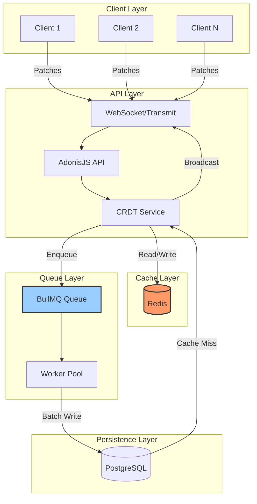
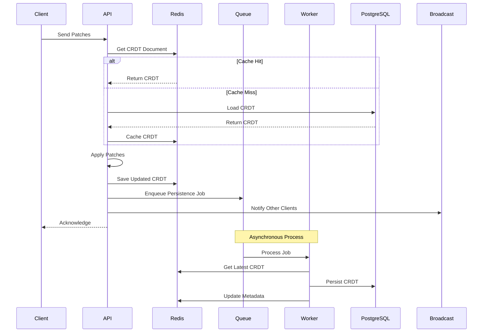
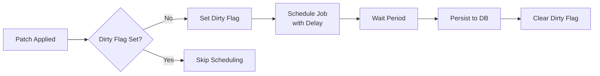
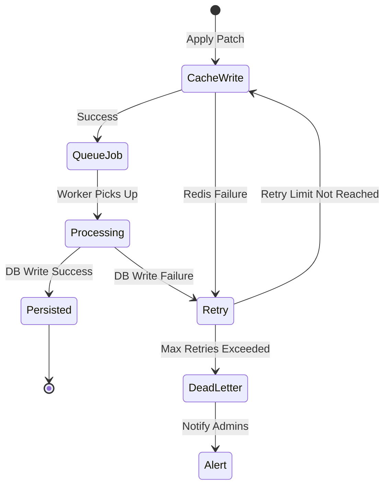

# Redis-Based CRDT Architecture with Asynchronous Database Writes

## Executive Summary

This document outlines a proposed architecture for improving CRDT performance by using Redis as a high-performance cache layer with asynchronous writes to PostgreSQL. This approach reduces database load, improves response times, and enhances scalability while maintaining data durability.

## Current Architecture Issues

1. **Every patch operation requires**:

   - Loading entire CRDT document from PostgreSQL
   - Applying patches in memory
   - Writing entire CRDT document back to PostgreSQL

2. **Performance Impact**:
   - Database I/O on every keystroke
   - Increased latency for real-time collaboration
   - Database becomes a bottleneck under load

## Proposed Architecture

### High-Level Overview



### Detailed Data Flow



## Component Design

### 1. Redis Cache Structure

```typescript
// Key Patterns
crdt:{tenant}:{list}:doc        // The CRDT document (binary)
crdt:{tenant}:{list}:version    // Current version number
crdt:{tenant}:{list}:lock       // Distributed lock for updates
crdt:{tenant}:{list}:dirty      // Flag indicating pending DB write
crdt:{tenant}:{list}:metadata   // Additional metadata (JSON)

// Example Keys
crdt:org_123:list_abc:doc       // CRDT binary data
crdt:org_123:list_abc:version   // "42"
crdt:org_123:list_abc:lock      // "worker_1:1234567890"
crdt:org_123:list_abc:dirty     // "1"
```

### 2. Cache Service Implementation (Using @adonisjs/cache)

The AdonisJS cache library provides a powerful abstraction layer that simplifies our implementation while adding advanced features like multi-tier caching, stampede protection, and grace periods.

```typescript
import cache from "@adonisjs/cache/services/main";
import redis from "@adonisjs/redis/services/main";

export default class CRDTCacheService {
  private readonly cacheTTL = "5m";
  private readonly graceTime = "30s";

  /**
   * Get CRDT with multi-tier caching (memory + Redis)
   */
  async get(tenantId: string, listId: string): Promise<Buffer | null> {
    // Use multi-tier cache: L1 (memory) -> L2 (Redis)
    return await cache.use("multi").get(`crdt:${tenantId}:${listId}:doc`);
  }

  /**
   * Get or regenerate CRDT with stampede protection
   */
  async getOrSet(
    tenantId: string,
    listId: string,
    factory: () => Promise<Buffer>
  ): Promise<Buffer> {
    return await cache
      .use("multi")
      .getOrSet(`crdt:${tenantId}:${listId}:doc`, factory, {
        ttl: this.cacheTTL,
        grace: this.graceTime, // Return stale data while regenerating
        tags: [`tenant:${tenantId}`, `list:${listId}`],
      });
  }

  /**
   * Set CRDT with tagging for easy invalidation
   */
  async set(tenantId: string, listId: string, doc: Buffer): Promise<void> {
    await cache.use("multi").set(`crdt:${tenantId}:${listId}:doc`, doc, {
      ttl: this.cacheTTL,
      tags: [`tenant:${tenantId}`, `list:${listId}`],
    });

    // Also mark as dirty for async persistence
    await redis.set(`crdt:${tenantId}:${listId}:dirty`, "1", "EX", 300);
  }

  /**
   * Invalidate all caches for a list
   */
  async invalidate(tenantId: string, listId: string): Promise<void> {
    // Clear by tags - removes from all cache tiers
    await cache.use("multi").clear([`list:${listId}`]);
  }

  /**
   * Atomic operations using Redis directly for fine control
   */
  async getAndLock(
    tenantId: string,
    listId: string,
    lockDuration: number
  ): Promise<Buffer | null> {
    const lockKey = `crdt:${tenantId}:${listId}:lock`;
    const lockId = `${process.pid}:${Date.now()}`;

    // Try to acquire lock
    const acquired = await redis.set(lockKey, lockId, "NX", "EX", lockDuration);
    if (!acquired) return null;

    // Get from cache
    const doc = await this.get(tenantId, listId);
    return doc;
  }
}
```

#### Cache Configuration

```typescript
// config/cache.ts
import { defineConfig, stores } from "@adonisjs/cache";

export default defineConfig({
  default: "multi",

  stores: {
    // In-memory L1 cache for hot data
    memory: stores.memory({
      maxSize: 100 * 1024 * 1024, // 100MB
    }),

    // Redis L2 cache
    redis: stores.redis({
      connection: "cache",
    }),

    // Multi-tier cache (memory -> Redis)
    multi: stores.multi({
      stores: ["memory", "redis"],
      strategy: "write-through", // Write to all tiers
    }),
  },

  // Global cache settings
  ttl: "10m",

  // Events for monitoring
  events: {
    "cache:hit": true,
    "cache:miss": true,
    "cache:write": true,
    "cache:forget": true,
  },
});
```

#### Benefits of Using @adonisjs/cache

1. **Multi-tier Caching**: Hot CRDTs stay in memory, warm in Redis
2. **Stampede Protection**: Prevents multiple requests from regenerating the same CRDT
3. **Grace Periods**: Serve stale data while regenerating in background
4. **Cache Tagging**: Easily invalidate all caches for a tenant or list
5. **Built-in Monitoring**: Cache hit/miss events for metrics

### 3. Queue Implementation with @rlanz/bull-queue

Using [@rlanz/bull-queue](https://github.com/RomainLanz/adonis-bull-queue) for reliable job processing:

```typescript
// app/jobs/persist_crdt.ts
import { Job } from "@rlanz/bull-queue";
import redis from "@adonisjs/redis/services/main";
import PatientList from "#models/patient_list";

export interface PersistCRDTPayload {
  tenantId: string;
  listId: string;
  version: number;
}

export default class PersistCRDT extends Job {
  static get key() {
    return "PersistCRDT";
  }

  static get options() {
    return {
      attempts: 3,
      backoff: {
        type: "exponential",
        delay: 2000,
      },
      removeOnComplete: true,
      removeOnFail: false,
    };
  }

  async handle(payload: PersistCRDTPayload) {
    const { tenantId, listId, version } = payload;

    // Get latest from Redis
    const cachedDoc = await redis.get(`crdt:${tenantId}:${listId}:doc`);
    const cachedVersion = await redis.get(`crdt:${tenantId}:${listId}:version`);

    // Version check to prevent overwriting newer data
    if (parseInt(cachedVersion) < version) {
      // Skip - newer version already persisted
      return;
    }

    // Persist to database
    await PatientList.query()
      .where("tenant_id", tenantId)
      .where("id", listId)
      .update({
        crdt_document: Buffer.from(cachedDoc, "base64"),
        crdt_version: cachedVersion,
        updated_at: new Date(),
      });

    // Mark as clean in Redis
    await redis.del(`crdt:${tenantId}:${listId}:dirty`);
  }
}

// Usage in controller
import Queue from "@rlanz/bull-queue/services/main";

// Enqueue persistence job
await Queue.dispatch(PersistCRDT.key, {
  tenantId,
  listId,
  version: currentVersion,
});
```

### 4. Write Strategies

#### Strategy 1: Debounced Writes (Recommended)



**Benefits**:

- Reduces database writes
- Groups multiple updates
- Better for rapid typing

**Configuration**:

```typescript
const WRITE_DELAY = 5000; // 5 seconds
const MAX_WRITE_DELAY = 30000; // 30 seconds max
```

#### Strategy 2: Write-Through for Critical Operations

```typescript
// For critical operations (e.g., patient discharge)
async applyCriticalPatch(patch: Patch) {
  await this.applyPatch(patch)
  await this.persistImmediately() // Skip queue, write directly
}
```

### 5. Failure Handling



### 6. Cache Warming Strategy

- **On Startup**: Pre-load frequently accessed patient lists (last 24 hours)
- **Cache Miss Handling**: Load from database and populate cache with appropriate TTL
- **TTL Strategy**: Recently accessed data gets longer TTL (2 hours vs 1 hour)

## Technology Stack

The implementation uses:

- **@adonisjs/cache**: High-level caching abstraction with multi-tier support
- **@adonisjs/redis**: Already installed, used for locks and direct operations
- **[@rlanz/bull-queue](https://github.com/RomainLanz/adonis-bull-queue)**: AdonisJS-specific BullMQ wrapper for job queue management
- **json-joy**: Existing CRDT library

## Configuration

### Cache Configuration

```typescript
// config/cache.ts
import { defineConfig, stores } from "@adonisjs/cache";

export default defineConfig({
  default: "multi",

  stores: {
    // In-memory L1 cache for hot data
    memory: stores.memory({
      maxSize: 100 * 1024 * 1024, // 100MB
    }),

    // Redis L2 cache
    redis: stores.redis({
      connection: "cache",
    }),

    // Multi-tier cache (memory -> Redis)
    multi: stores.multi({
      stores: ["memory", "redis"],
      strategy: "write-through",
    }),
  },
});
```

### Redis Configuration

```typescript
// config/redis.ts
export default {
  connection: "cache",
  connections: {
    cache: {
      host: env.get("REDIS_HOST"),
      port: env.get("REDIS_PORT"),
      password: env.get("REDIS_PASSWORD"),
      db: 0,
      keyPrefix: "reverb:",
      // CRDT-specific settings
      maxRetriesPerRequest: 3,
      enableReadyCheck: true,
      connectTimeout: 10000,
    },
  },
};
```

### Queue Configuration

```typescript
// config/queue.ts
import { defineConfig } from "@rlanz/bull-queue";

export default defineConfig({
  defaultConnection: "main",
  connections: {
    main: {
      host: env.get("REDIS_HOST"),
      port: env.get("REDIS_PORT"),
      password: env.get("REDIS_PASSWORD"),
      db: 1, // Use different DB for queues
      keyPrefix: "bull:",
    },
  },
});
```

## References

### AdonisJS Documentation

- [AdonisJS Cache Guide](https://docs.adonisjs.com/guides/digging-deeper/cache) - Official caching documentation
- [HTTP Context](https://docs.adonisjs.com/guides/concepts/http-context#http-context) - Context usage in middleware
- [Redis Integration](https://docs.adonisjs.com/guides/digging-deeper/redis) - Redis setup and usage

### Queue Libraries

- [@rlanz/bull-queue](https://github.com/RomainLanz/adonis-bull-queue) - Recommended queue package for AdonisJS
- [BullMQ Documentation](https://docs.bullmq.io/) - Underlying queue system documentation

### CRDT Resources

- [json-joy Documentation](https://github.com/streamich/json-joy) - CRDT library used in the project

## Conclusion

This architecture provides a robust, scalable solution for CRDT operations while maintaining data consistency and durability. The use of Redis as a cache layer with asynchronous database writes significantly improves performance and user experience while keeping the system maintainable and observable.
